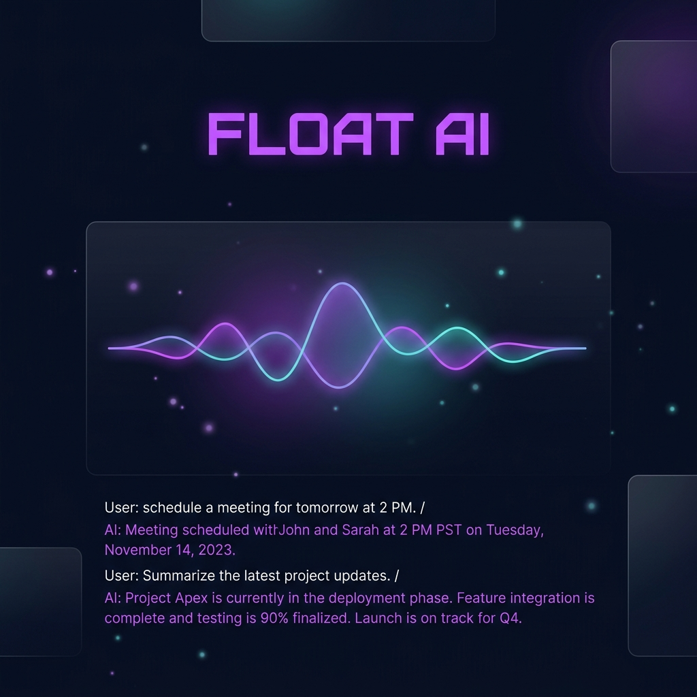
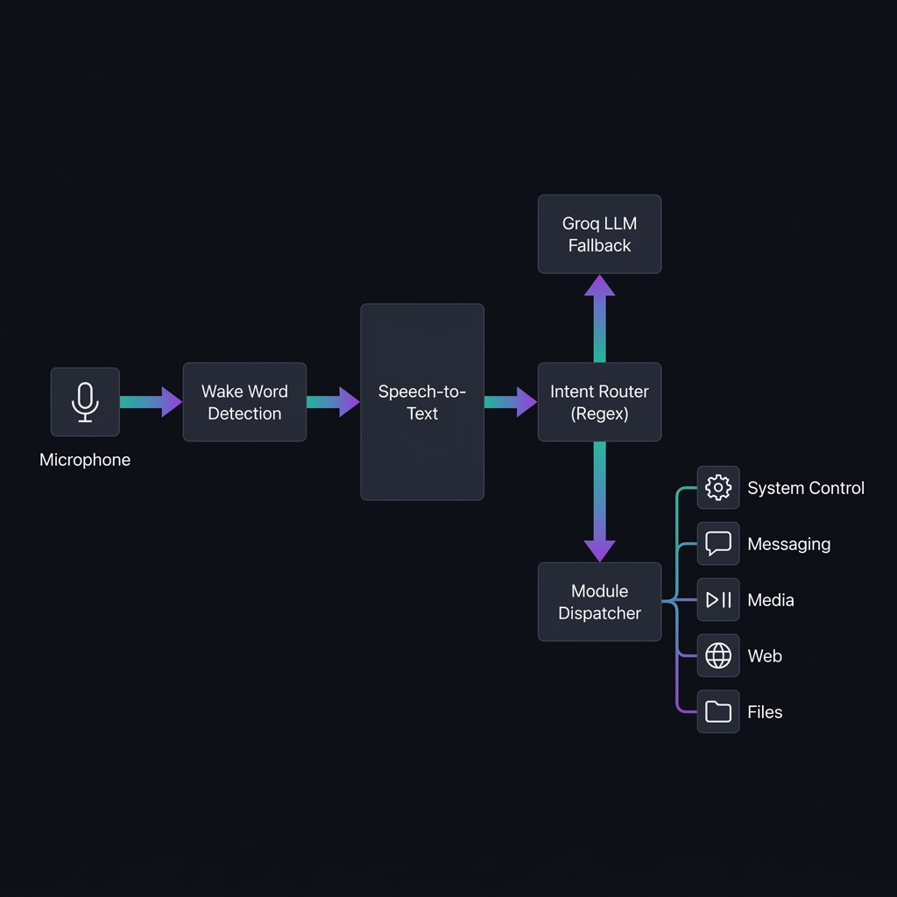

<div align="center">

# 🤖 FLOAT — AI Desktop Assistant



### ⚡ A fully-featured, voice-activated AI desktop assistant powered by Groq (LLaMA 3.3 70B)

[](https://python.org)
[](https://groq.com)
[]()
[](LICENSE)

**FLOAT** listens, understands, and acts — controlling your system, messaging your contacts, playing your music, and answering your questions — all without you touching the keyboard.

[🚀 Quick Start](#-quick-start-windows) · [✨ Features](#-features) · [🎤 Voice Commands](#-voice-commands-reference) · [📂 Project Structure](#-project-structure)

</div>

---

## 📋 Table of Contents

- [✨ Features](#-features)
- [🏗️ Architecture — How It Works](#️-architecture--how-it-works)
- [🔧 Requirements](#-requirements)
- [🚀 Quick Start (Windows)](#-quick-start-windows)
- [🐧 Quick Start (Linux / macOS)](#-quick-start-linux--macos)
- [🔑 API Keys Setup](#-api-keys-setup)
- [🎬 FFmpeg Installation](#-ffmpeg-installation-windows)
- [🎤 Voice Commands Reference](#-voice-commands-reference)
- [📂 Project Structure](#-project-structure)
- [🧩 Module Deep-Dive](#-module-deep-dive)
- [🛠️ Troubleshooting](#️-troubleshooting)
- [📄 License](#-license)

---

## ✨ Features

| Category | Capabilities | Module |
|---|---|---|
| 🧠 **AI Brain** | LLaMA 3.3 70B via Groq API, 20-message conversation memory, system prompt persona | `brain.py` |
| 🎙️ **Wake Word** | Continuous `"Float"` detection with fuzzy matching — fully hands-free | `voice.py` |
| 🗣️ **Voice I/O** | Google STT + pyttsx3 TTS (offline) → Edge TTS (neural voices) → gTTS fallback chain | `voice.py` |
| 🌐 **Bilingual** | Seamless English ↔ Hindi switching (Devanagari script), per-language neural voices | `voice.py` |
| 💻 **System Control** | WiFi, Bluetooth, Volume (pycaw), Brightness (WMI), App Launcher, Screenshot, Lock, Shutdown/Restart/Sleep | `system_control.py` |
| 💬 **WhatsApp** | Selenium-powered automation — send messages to contacts & groups, persistent login session | `whatsapp.py` |
| 📧 **Email** | Gmail send (SMTP) & read (IMAP) with AI-generated summaries | `messaging.py` |
| 📇 **Contacts** | Fuzzy name lookup, save/retrieve phone numbers via voice | `messaging.py` |
| 🎵 **Music** | Spotify (spotipy), YouTube (yt-dlp), Local ~/Music library — unified play/pause/next/prev | `media.py` |
| 🌤️ **Weather** | Real-time weather from OpenWeatherMap for any city | `web.py` |
| 📰 **News** | Top headlines from NewsAPI | `web.py` |
| 🔍 **Search** | Google Search + Wikipedia summaries | `web.py` |
| ⏰ **Reminders** | Natural language reminders ("remind me in 30 minutes"), persisted to JSON | `files.py` |
| ✅ **To-Do** | Voice-controlled task list — add, list, complete, delete | `files.py` |
| 🔢 **Calculator** | Safe math evaluation with voice-friendly parsing ("5 times 3 plus 7") | `files.py` |
| ⏱️ **Timer** | Countdown timers and stopwatch | `files.py` |
| 💰 **Expenses** | Log daily expenses by category, get monthly/daily summaries | `expenses.py` |
| 📁 **Files** | Create, read, search, open files — file content summarised by AI | `files.py` |
| 🖥️ **GUI** | Animated tkinter dashboard with waveform visualiser, conversation log, quick-action buttons, system tray | `gui.py` |

---

## 🏗️ Architecture — How It Works



FLOAT uses a **multi-threaded pipeline** so the GUI never freezes while processing commands:

```
┌─────────────────────────────────────────────────────────────────────────┐
│                          FLOAT AI — Runtime                             │
│                                                                         │
│  Main Thread          WakeWord Thread         Command Thread(s)         │
│  ───────────          ────────────────         ──────────────────        │
│  ┌──────────┐         ┌──────────────┐         ┌───────────────┐        │
│  │  GUI     │◄────────│  Microphone  │         │  dispatch()   │        │
│  │ tkinter  │  queue  │  Listener    │────────►│  ┌─────────┐  │        │
│  │ mainloop │         │  (voice.py)  │  text   │  │ Intent  │  │        │
│  └──────────┘         └──────────────┘         │  │ Router  │  │        │
│       ▲                                        │  └────┬────┘  │        │
│       │ status/messages                        │       │       │        │
│       │                                        │  ┌────▼────┐  │        │
│       └────────────────────────────────────────│  │ Module  │  │        │
│                                                │  │ Call    │  │        │
│                                                │  └────┬────┘  │        │
│                                                │       │       │        │
│                                                │  ┌────▼────┐  │        │
│                                                │  │ speak() │  │        │
│                                                │  │ + GUI   │  │        │
│                                                │  └─────────┘  │        │
│                                                └───────────────┘        │
└─────────────────────────────────────────────────────────────────────────┘
```

### 🔄 Step-by-Step Flow

1. **🎧 Listening** — `WakeWordListener` (daemon thread) continuously listens for the word **"Float"** using Google STT with fuzzy matching.
2. **🔔 Activation** — On detection, a chime plays and the GUI status changes to `"Listening..."`. The animated waveform activates.
3. **📝 Transcription** — The user's command is captured and transcribed via Google Speech Recognition (supports English and Hindi).
4. **🧠 Intent Routing** — `brain.py` runs the text through **46+ regex patterns** for fast-path intent detection. If no pattern matches → falls back to **Groq LLM** for open-ended conversation.
5. **⚡ Entity Extraction** — Once intent is identified, `extract_entities()` pulls structured data (contact names, song titles, volume levels, cities, etc.) from the raw text.
6. **📡 Dispatch** — `float.py` maps the intent to the correct module function (e.g., `"play_music"` → `media.py.play_music()`).
7. **🔊 Response** — Result text is displayed in the GUI conversation log AND spoken aloud via the TTS engine.

### 🗣️ TTS Engine Cascade

FLOAT uses a smart fallback chain for voice output:

```
pyttsx3 (offline, fast) → Edge TTS (neural, HD voices) → gTTS (Google, online)
```

- **English**: `en-US-ChristopherNeural` (deep male voice via Edge TTS)
- **Hindi**: `hi-IN-MadhurNeural` (native Hindi voice via Edge TTS)

---

## 🔧 Requirements

| Requirement | Details |
|---|---|
| 🐍 **Python** | 3.11 or higher |
| 💻 **OS** | Windows 10/11 (primary), Linux, macOS |
| 🎤 **Hardware** | Microphone for voice input |
| 🎬 **FFmpeg** | Required for YouTube audio playback |
| 🌐 **Internet** | Required for API calls (Groq, Weather, News, etc.) |

---

## 🚀 Quick Start (Windows)

```bash
# 1. Clone / download the project
cd "FLOAT AI"

# 2. Run the one-command installer
setup.bat

# 3. Edit your API keys
notepad .env

# 4. Launch FLOAT
python float.py
```

> [!TIP]
> The `setup.bat` script automatically: upgrades pip, installs all dependencies, checks for FFmpeg, creates `.env` from template, and sets up directories.

---

## 🐧 Quick Start (Linux / macOS)

```bash
cd "FLOAT AI"

# Create and activate a virtual environment
python3 -m venv venv
source venv/bin/activate

# Install dependencies
pip install -r requirements.txt

# Copy and fill in your .env
cp .env.template .env
nano .env

# Run
python float.py
```

---

## 🔑 API Keys Setup

All keys go in your `.env` file (never commit this!):

### 1. 🧠 Groq API Key (**Required**)
1. Sign up at [console.groq.com](https://console.groq.com)
2. Create an API key
3. Add to `.env`: `GROQ_API_KEY=your_key`

### 2. 📧 Gmail App Password (for email)
1. Go to your Google Account → Security
2. Enable 2-Step Verification
3. Go to **App Passwords**, generate one for "Mail"
4. Add to `.env`:
   ```env
   GMAIL_ADDRESS=you@gmail.com
   GMAIL_APP_PASSWORD=your_16_char_password
   ```

### 3. 🌤️ OpenWeatherMap (weather)
1. Register at [openweathermap.org](https://openweathermap.org/api)
2. Get free API key
3. Add to `.env`: `WEATHER_API_KEY=your_key`

### 4. 📰 NewsAPI (news headlines)
1. Register at [newsapi.org](https://newsapi.org)
2. Get free API key
3. Add to `.env`: `NEWS_API_KEY=your_key`

### 5. 🎵 Spotify (optional)
1. Go to [developer.spotify.com](https://developer.spotify.com/dashboard)
2. Create an app, set redirect URI to `http://localhost:8888/callback`
3. Add to `.env`:
   ```env
   SPOTIPY_CLIENT_ID=your_client_id
   SPOTIPY_CLIENT_SECRET=your_client_secret
   SPOTIPY_REDIRECT_URI=http://localhost:8888/callback
   ```

---

## 🎬 FFmpeg Installation (Windows)

Required for YouTube audio playback:

1. Download from [gyan.dev/ffmpeg/builds](https://www.gyan.dev/ffmpeg/builds/)
2. Extract and add the `bin` folder to your `PATH`
3. Verify: `ffmpeg -version`

---

## 🎤 Voice Commands Reference

### 💻 System Control
```
"Float, turn on WiFi"               "Float, turn off Bluetooth"
"Float, set volume to 60"           "Float, volume up"
"Float, set brightness to 80"       "Float, take a screenshot"
"Float, open Chrome"                "Float, open VS Code"
"Float, lock my screen"             "Float, shutdown the computer"
```

### 💬 Messaging
```
"Float, text Mom I'll be home late"
"Float, text the family group Happy Diwali"
"Float, save Mom's number as +919876543210"
"Float, what's Mom's number?"
"Float, read my latest emails"
```

### 🎵 Media
```
"Float, play Blinding Lights on Spotify"
"Float, play lo-fi beats"           "Float, pause music"
"Float, next song"                  "Float, previous track"
```

### 🌐 Web & Search
```
"Float, what's the weather in Mumbai?"
"Float, tell me the news"
"Float, search Python tutorials"
"Float, open YouTube"
"Float, who is Elon Musk?"          (Wikipedia)
```

### ⏰ Productivity
```
"Float, remind me to take medicine in 1 hour"
"Float, add buy groceries to my to-do list"
"Float, show my to-do list"
"Float, set a 20 minute timer"
"Float, start stopwatch"            "Float, stop stopwatch"
"Float, what is 458 divided by 13?"
"Float, read my notes.txt file"
```

### 💰 Finance
```
"Float, add 500 rupees to food"
"Float, how much have I spent this month?"
```

### 🌐 Language
```
"Float, switch to Hindi"            → ठीक है सर, मैं अब हिंदी में बात करूँगा।
"Float, speak in English"           → Sure sir, I will speak in English now.
```

---

## 📂 Project Structure

```
FLOAT AI/
│
├── 🚀 float.py              # Main entry point — wires all modules, launches GUI event loop
├── 🧠 brain.py              # Groq API client, 46+ regex intent patterns, entity extraction
├── 🎙️ voice.py              # Wake word listener, STT (Google), TTS cascade (pyttsx3→Edge→gTTS)
├── 🖥️ gui.py                # Animated tkinter dashboard, waveform, conversation log, system tray
├── ⚙️ system_control.py     # WiFi, Bluetooth, Volume, Brightness, App Launcher, Screenshot, Power
├── 💬 whatsapp.py           # Selenium Chrome automation — persistent WhatsApp Web session
├── 📬 messaging.py          # Contact management (JSON), WhatsApp dispatch, Gmail SMTP/IMAP
├── 🎵 media.py              # Spotify (spotipy), YouTube (yt-dlp), local music, unified controls
├── 🌍 web.py                # Google Search, Wikipedia, OpenWeatherMap, NewsAPI
├── 📁 files.py              # Reminders, To-dos, Calculator, Timer, Stopwatch, File I/O
├── 💰 expenses.py           # Expense logging & category-wise summaries
├── 🔧 config.py             # .env loader, all constants, rotating file logger
│
├── 📦 requirements.txt      # Python dependencies (~20 packages)
├── 🛠️ setup.bat             # Windows one-command installer
├── 🔑 .env.template         # Template for API keys
├── 🔑 .env                  # Your actual API keys (git-ignored)
├── 📇 contacts.json         # Saved WhatsApp contacts
├── ⏰ reminders.json        # Persisted reminders
├── 🎨 assets/               # Chime sound, banner, architecture diagram
│   ├── chime.wav
│   ├── banner.png
│   └── architecture.png
├── 📋 logs/                  # Rotating log files (10 MB max, 3 backups)
│   └── float.log
└── 💬 whatsapp_session/      # Persistent Chrome profile for WhatsApp Web
```

---

## 🧩 Module Deep-Dive

### 🧠 `brain.py` — The Intelligence Layer

- **Intent Router**: 46+ compiled regex patterns covering system control, messaging, media, web, productivity, and language switching — each mapping to a handler key.
- **Entity Extraction**: Context-aware extraction of structured data — volume levels, contact names, song titles, cities, math expressions, time durations, etc.
- **Conversation Memory**: Maintains a rolling 20-exchange history for contextual follow-up conversations.
- **Groq Fallback**: Any unmatched command is sent to LLaMA 3.3 70B for open-ended AI responses.

### 🎙️ `voice.py` — Voice Engine

- **Wake Word Loop**: Runs in a dedicated daemon thread with the microphone held open (no re-acquisition latency). Detects `"float"` and fuzzy aliases (`"flot"`, `"flow"`, `"flute"`, etc.).
- **Chime Generator**: If `assets/chime.wav` is missing, auto-generates a 440Hz sine-wave chime programmatically.
- **TTS Worker Thread**: Dedicated thread processes a queue of speech requests — preventing GUI freezes during voice synthesis.
- **Language Switching**: Runtime toggle between English and Hindi — dynamically switches both STT language and TTS voice.

### 🖥️ `gui.py` — Dashboard Interface

- **Dark Theme**: Deep navy background (`#0d0d14`) with purple (`#6c63ff`) and teal (`#00d4aa`) accents.
- **Waveform Animation**: 24-bar animated equalizer — idle (tiny bumps) vs. active (full sine-wave animation at 45ms refresh).
- **Status Indicator**: Color-coded dot — grey (sleeping), teal (listening), purple (thinking).
- **System Tray**: Minimise-to-tray with `pystray` — "Show FLOAT" and "Quit" options via right-click.

### 💬 `whatsapp.py` — WhatsApp Automation

- **Persistent Login**: Uses a dedicated Chrome profile directory so QR code only needs to be scanned once.
- **Dual Send Modes**: Direct message via phone number URL, or group message via search-box navigation.
- **Robust Selectors**: Multiple fallback CSS/XPath selectors for each WhatsApp Web element.
- **Thread-Safe**: All driver operations wrapped in a `threading.RLock()`.

### ⚙️ `system_control.py` — OS Integration

- **Cross-Platform**: Windows (primary), Linux, and macOS paths for every operation.
- **20+ App Aliases**: Maps natural names ("chrome", "vscode", "task manager") to executables.
- **Voice Confirmation**: Destructive actions (shutdown/restart) require spoken "yes" confirmation.
- **Volume Control**: Uses `pycaw` (Windows), `pulsectl` (Linux), or `osascript` (macOS).

---

## 🛠️ Troubleshooting

| Problem | Fix |
|---|---|
| 🔴 `PyAudio install fails` | Install via `pipwin install pyaudio` or use the wheel from [unofficial binaries](https://www.lfd.uci.edu/~gohlke/pythonlibs/) |
| 🎤 `No voice detected` | Check microphone permissions in Windows Settings → Privacy → Microphone |
| 🧠 `Groq API error` | Verify your `GROQ_API_KEY` in `.env` — get one free at [console.groq.com](https://console.groq.com) |
| 🎬 `YouTube won't play` | Install FFmpeg and ensure it's in your system PATH |
| 🔊 `pycaw not found` | Run `pip install pycaw comtypes` |
| 💬 `WhatsApp QR scan needed` | On first run, a Chrome window opens — scan the QR with your phone. Subsequent runs auto-login. |
| 💥 `FLOAT crashes at startup` | Check `logs/float.log` for the full error trace |
| 🔇 `Hindi TTS sounds wrong` | FLOAT auto-uses Edge TTS for Hindi; ensure `edge-tts` is installed: `pip install edge-tts` |

---

## 📄 License

MIT — Free to use, modify, and distribute.

---

<div align="center">

Made with ❤️ by **Krish** for a smarter, hands-free desktop experience.

**⭐ Star this repo if FLOAT helped you!**

</div>
